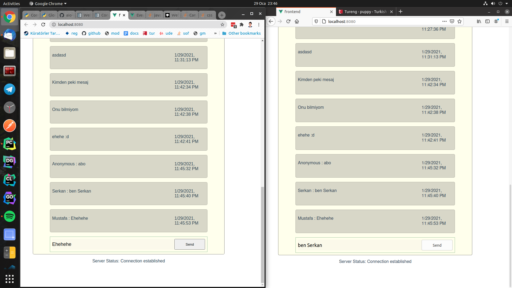

# Real Time Kafka Chat

## Usage

* Everyone's message appears in the same list below
* You can press enter(when input is focused) to send messages or press send button

## Technologies

* Kafka is used for message streaming and storage.
* Websocket is used for showing and sending messages without a reload need.
* Asyncio is used for asynchronous usage of Kafka.

## Running

* Install docker and docker-compose
* Run `docker-compose up -d` in root folder
* Go to localhost:8080 using more than one browser to test

## SS

